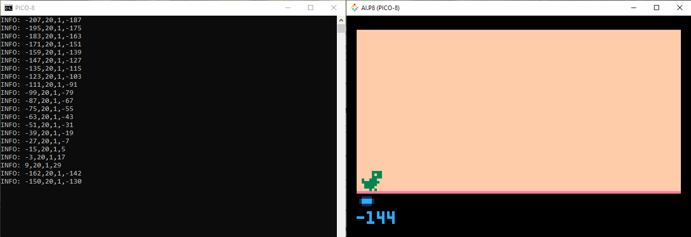

# pico8


## Submit game

control + 7 to take picture

export {name}.p8.png. 

ex: export towerdefense.p8.png

https://www.lexaloffle.com/pico-8.php?page=submit

https://www.lexaloffle.com/bbs/?tid=142633


## Keyboard shortcuts

puny font mode (Ctrl+P).

## Debug

In, shortcut, update target:

cmd /c "C:\Program Files (x86)\PICO-8\pico8.exe"

printh("add text to debug here")

example:

```lua
printh(inputs[1]..","..node.b..","..node.w0..","..sum)
```


 
## References:

[Lua for pico 8](https://pico-8.fandom.com/wiki/Lua)

[remote access handheld](http://192.168.0.118/files/pico-8/carts/) ark/ark user/password

